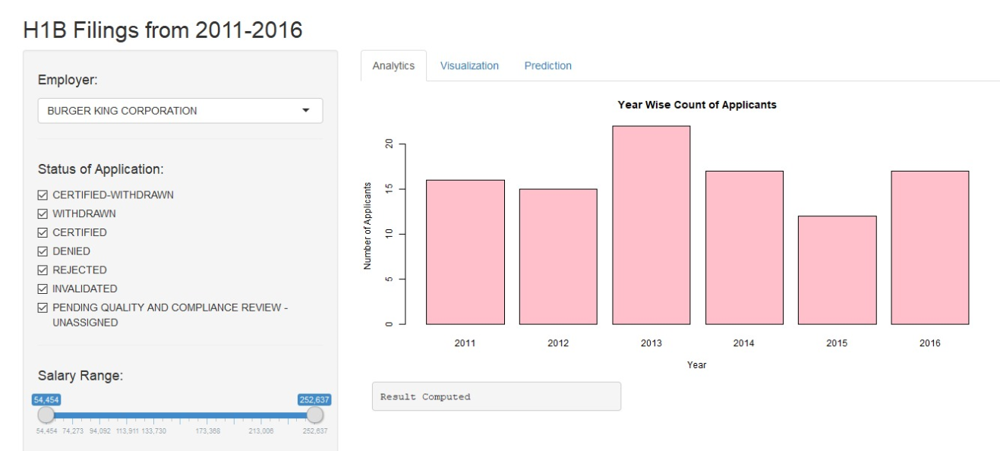
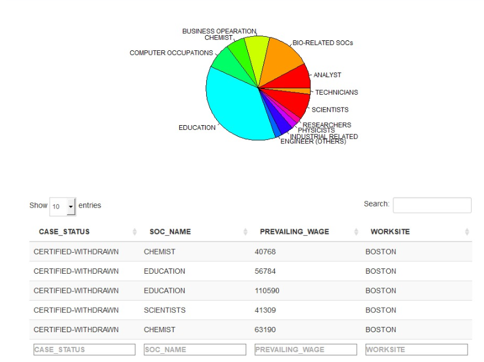

```{r setup, include=FALSE}
knitr::opts_chunk$set(echo = TRUE)
```

###NOTE: For successful running of the .Rmd file, it is mandatory to store the following files in the same directory:
#######(*These files were submitted during the RShinyApp submission on 08Apr2019*)
  + Data file ("h1b_kaggle.csv")
  + Cleaned Data (h1bData.Rds)
  + predictionData (fit.Rds, fitE.Rds)
  + global.R
  + helperFunctions.R
  + mapCodes.R
  + predit.R
  + ui.R
  + server.R
  + bar_plot.png
  + hover_pie_table.png
  + heat_bubble_map.png
  + prediction_model.png


#__PROJECT STRUCTURE:__

###RShiny files:
  + global.R
  + ui.R
  + server.R
  
  
###Helper Files:
  + helperFunctions.R
  + mapCodes.R
  + predict.R


#global.R FILE

The Global.R file is first to execute when a Shiny application is started. We have performed three operations in this file.
1. Import Libraries
2. Imported helper files using 'source'
3. Executed initlization functions to read and clean data, generate prediction model and create global variables.


#####Data Manipulation Packages
```{r}

library(tidyverse)
library(dplyr)
```

#####Data Visualization Packages
```{r}

library(shiny)
library(leaflet)
library(ggplot2)
library(usmap)
library(plotly)
library(shinydashboard)
library(flexdashboard)

```


#####Prediction Package
```{r}

library(rpart)

```


##DATA: H1B FILINGS FROM 2011 - 2016
######(*Data from Kaggle.com*)
```{r}
h1b <- read_csv("h1b_kaggle.csv")


#Showing the dimension of data file
dim(h1b)
```
*The variables of the data are defined as follows:

+ Column1: Serial Number of the observations
+ CASE_STATUS: Status of the H1B application, as in Certified, Withdrawn, Denied, etc.
+ EMPLOYER_NAME: The Employer who has filed H1b application for the candidate
+ SOC_NAME: All the jobs are categorised under few Standard Occupational Classifications (SOC) listed in this column
+ JOB_TITLE: Job title of the candidate
+ FULL_TIME_POSITION: True/False value for if the job is a full-time
+ PREVAILING_WAGE: Wage for which the H1b has been filed
+ Year: Year of filing H1b application
+ WORKSITE: City in which the aplication has been filed
+ STATES: State in which the aplication has been filed
+ LAT: Latitude of application
+ LON: Longitute of application


The "helperFunctions.R" file has all the data-manipulation functions which have been used in loading data, transforming data and for creating plots.  
```{r}
source("helperFunctions.R")
```


The "mapCodes.R" file has all the functions and codes used for creating map in the Shiny App.
```{r}
source("mapCodes.R")
```


The "predict.R" file has function and codes for decision tree model which we have used for prediction.
```{r}
source("predict.R")
```

All the following functions are included in the "helperFunctions.R" file and would be explained in the respective chunks later in the report.
```{r}
loadData()
initData()
loadFitWithEMp(h1b)
loadFitNoEMp(h1b)
```


#helperFunctions.R FILE

##All the Functions from the "helperFunction.R" are explained one by one chunk below:

### The "loadData" function checks if 'cleanedData' is already in the working directory. If the file exists: it will print ("Cleaned file exists") and then loads the available .Rds file. If 'cleanedData' doesnot exist in the working directory, it will read the raw data ("h1b_kaggle.csv"), clean it by calling the 'cleanData' function and save a new .Rds file in the working directory.  

```{r}
loadData <- function(){
  if(file.exists("./cleanedData/h1bData.Rds")){
    print("Cleaned file exists")
    h1b<<- readRDS("./cleanedData/h1bData.Rds")
  }
  else{
    print("Clean file does not exist, reading data file..")
    h1b<<- read_csv("h1b_kaggle.csv")
    h1b<<- cleanData(h1b)
    print("Saving cleaned file")
    saveRDS(h1b,file="./cleanedData/h1bData.Rds")
    print("Save cleaned file")
  }
}

```


###The 'initData' functions will create various dataframes and data variables, and save them in Global Environment. These dataframes and lists will be accessed further in different files of the project for creating the RShiny app.

```{r}
initData <-function(){
  emp <<- unique(h1b$EMPLOYER_NAME)
  yearwise <<- data.frame(h1b$YEAR)
  caseStatus <<- unique(h1b$CASE_STATUS)
  jobSoc <<- unique(h1b$SOC_NAME)
  stateList <<- unique(h1b$STATES)
  employerNames <<- unique(h1b$EMPLOYER_NAME)
  minH1bSal <<- min(h1b$PREVAILING_WAGE, na.rm = T)
  maxH1bSal<<- max(h1b$PREVAILING_WAGE, na.rm = T)
}

```

###The 'computeData' function creates a filtered dataframe for our shinyApp panels. It computes datafrmes for unique 'CASE_STATUS', unique 'EMPLOYER_NAMES', minimum and maximum 'PREVAILING_WAGE' depending on the condition if the 'Employer Name' is given or not.These dataframes are used in the Shiny App and in the prediction model. Two prediction models are developed in the project based on which if the 'EmployerName' is provided or not. 


```{r}

computeData <- function(h1data, h1status=caseStatus, empName=NULL,
                        empSalMin=minH1bSal, empSalMax=maxH1bSal){
  if(is.null(empName)){
    return(filter(h1data, CASE_STATUS %in% c(h1status)
                  & PREVAILING_WAGE >= empSalMin 
                  & PREVAILING_WAGE<= empSalMax  ))  
  }
  else{
    return(filter(h1data, CASE_STATUS %in% c(h1status)
                  & EMPLOYER_NAME== empName 
                  & PREVAILING_WAGE >= empSalMin 
                  & PREVAILING_WAGE<= empSalMax  ))  
  }
}

```


###The 'plotData' function calls the 'computeData' function and generates data for bar plot summarizing the data 'YEAR-WISE' and return a table data. The same data will be rendered in ui.R for plotting Bar Plot.

```{r}
plotData <- function(h1data, 
                     h1status=caseStatus, 
                     empName=null, empSalMin=minH1bSal, 
                     empSalMax=maxH1bSal){
  
  filteredData <- computeData(h1data,h1status,empName,empSalMin, empSalMax)
  
  return(table(filteredData$YEAR))
}

```


###The 'h1bPlot' function calls the 'plotData' function and returns a Bar Plot in the main panel of the ShinyApp.

```{r}

h1bPlot <- function(h1bData = h1b,
                    status =caseStatus,
                    employers=NULL, 
                    minSal=minH1bSal,
                    maxSal=maxH1bSal){
  
  return (barplot(plotData(h1b,status,employer,minSal, maxSal)))
  
}

```

```{r , fig.cap="Bar Plot - H1b Applicant from 2011-16", out.width = '100%'}

```


###The 'jobPieData' function filters year-wise grouped data and gives tabular return of all the SOC (Standard Occupational Classification) jobs for that year. This data has been rendered in the ui.R to plot Pie Chart when mouse is hovered on the the Bar Plot. The Pie Chart is developed for the data contained in the Bar Ploton which the mouse is hovering.  

```{r}
jobPieData <- function(h1Data, byYear = NULL){
  result <- h1Data
  if(!is.null(byYear)){
    result <- filter(h1Data,YEAR == byYear)
  }
  return(table(result$SOC_NAME))
}

```

###The 'dataForUIFrmae' function gives tabular result for 'Case Status', 'SOC Name', 'Wage' and 'WorkSite'. If Year variable is parsed to this function, it groups data year-wise, else without considering the 'Year' variable. This data is used in creating the table in the main panel when mouse is hovered on the Bar Plot.

```{r}
dataForUIFrame <- function(h1Data,byYear=NULL){
  result <- h1Data
  if(!is.null(byYear)){
    result <- filter(h1Data,YEAR == byYear)
  }
  result <- result[c("CASE_STATUS","SOC_NAME","PREVAILING_WAGE","WORKSITE")]
  return(result)
  
}
```

```{r , fig.cap="Pie Chart and Data Table created by Hover on Bar-Plot", out.width = '100%'}

```


###The 'cleanData' function is used to clean the data in the 'SOC_Name' and 'Employer_Name' columns. 'cat' function has been used to display in the starting of running this function "Cleaning data". After each line of cleaning is performed, one period(.) is added to the display using cat('.'). The data has been cleaned by detecting string match using regular expression. This considerably improves the run-time of the application.

###Once the cleaning is done, it displays "done cleaning" and returns 'dataToClean' with all cleaning operations performed.

```{r}
cleanData <- function(dataToClean){
  cat("Cleaning data")
  dataToClean$SOC_NAME <- str_to_upper(dataToClean$SOC_NAME)
  cat('.')
  dataToClean$EMPLOYER_NAME <- str_to_upper(dataToClean$EMPLOYER_NAME)
  cat('.')
  dataToClean$SOC_NAME <- gsub("^[0-9].*", "NA", dataToClean$SOC_NAME)
  cat('.')
  dataToClean$SOC_NAME <- gsub(".*ANALYST.*|.*ANALYSIS.*|.*ANALSYSTS.*|.*ANAL.*", 
                               "ANALYST", dataToClean$SOC_NAME)
  cat('.')
  dataToClean$SOC_NAME <- gsub(".*BUSINESS.*|.*OPERATION.*|.*BUYER.*|.*PURCHASE.*|
                               .*COST.*|.*CUSTOMER.*",
                               "BUSINESS OPEARATION", dataToClean$SOC_NAME)
  cat('.')
  dataToClean$SOC_NAME <- gsub(".*TEACH.*|.*EDUCATION.*|.*TUTOR.*", 
                               "EDUCATION", dataToClean$SOC_NAME)
  cat('.')
  dataToClean$SOC_NAME <- gsub(".*BIO.*", "BIO-RELATED SOCs", dataToClean$SOC_NAME)
  cat('.')
  dataToClean$SOC_NAME <- gsub(".*CIVIL.*", "CIVIL ENGG./PLANNERS", dataToClean$SOC_NAME)
  cat('.')
  dataToClean$SOC_NAME <- gsub(".*RESEARCH.*", "RESEARCHERS", dataToClean$SOC_NAME)
  cat('.')
  dataToClean$SOC_NAME <- gsub(".*SCIENTIST.*", "SCIENTISTS", dataToClean$SOC_NAME)
  cat('.')
  dataToClean$SOC_NAME <- gsub(".*MANAGER.*|.*MAANGER.*", "MANAGER", dataToClean$SOC_NAME)
  cat('.')
  dataToClean$SOC_NAME <- gsub(".*INDUSTRIAL.*|.*INDUATRIAL.*",
                               "INDUSTRIAL RELATED", dataToClean$SOC_NAME)
  cat('.')
  
  dataToClean$SOC_NAME <- gsub(".*TECHNICIAN.*|.*OPERATOR.*|.*MECHANIC.*|.*MACHINE.*", 
                               "TECHNICIANS", dataToClean$SOC_NAME)
  cat('.')
  dataToClean$SOC_NAME <- gsub(".*ART.*|.*WRITE.*|.*DANCE.*|.*STAGE.*", 
                               "ART & CREATIVE", dataToClean$SOC_NAME)
  cat('.')
  dataToClean$SOC_NAME <- gsub(".*SUPERVISOR.*", "SUPERVISORS", dataToClean$SOC_NAME)
  cat('.')
  dataToClean$SOC_NAME <- gsub(".*ACCOUNTANT.*|.*BILL.*", "ACCOUNTANT",
                               dataToClean$SOC_NAME)
  cat('.')
  dataToClean$SOC_NAME <- gsub(".*AGRI.*", "AGRICULTURE", dataToClean$SOC_NAME)
  cat('.')
  dataToClean$SOC_NAME <- gsub(".*APPLICATION.*|.*PROGRAMMERS.*|.*PROGRAMMER.*|
                               .*PROGRAMERS.*|.*PROGRAMER.*|.*PROGRAMMGER.*|
                               .*POGRAMMERS.*|.*POGRAMMERS.*|.*SOFTWARE.*|.*DEVELOPER.*", 
                               "SOFTWARE ENGINEER", dataToClean$SOC_NAME)
  cat('.')
  
  dataToClean$SOC_NAME <- gsub(".*DATA.*|.*DATEBASE.*", "DATA RELATED",
                               dataToClean$SOC_NAME)
  cat('.')
  dataToClean$SOC_NAME <- gsub(".*COMPUTER.*|.*COMUTER.*", "COMPUTER OCCUPATIONS", 
                               dataToClean$SOC_NAME)
  cat('.')
  dataToClean$SOC_NAME <- gsub(".*CONSTRUCTION.*|.*BUILDING.*", 
                               "BUILDING & CONSTRUCTION", dataToClean$SOC_NAME)
  cat('.')
  dataToClean$SOC_NAME <- gsub(".*SALE.*", "SALES REPRESENTATIVE", dataToClean$SOC_NAME)
  cat('.')
  dataToClean$SOC_NAME <- gsub(".*LAW.*|.*ATTORNEY.*", "LAW & ORDER",
                               dataToClean$SOC_NAME)
  cat('.')
  dataToClean$SOC_NAME <- gsub(".*ELECTRIC.*|.*HEATING.*|.*ELETRICAL.*", 
                               "ELECTRICAL OCCUPATIONS", dataToClean$SOC_NAME)
  cat('.')
  dataToClean$SOC_NAME <- gsub(".*PLANNER.*", "PLANNERS", dataToClean$SOC_NAME)
  cat('.')
  dataToClean$SOC_NAME <- gsub(".*NURSE.*|.*NURSING.*", "NURSING", dataToClean$SOC_NAME)
  cat('.')
  dataToClean$SOC_NAME <- gsub(".*PHYSICIAN.*|.*NEUROLOGISTS.*|.*SURGEON.*|
                               .*PRACTIONER.*|.*PRACTICIONER.*|.*PRACTITIONER.*|
                               .*PRACTIONER.*", "HEALTHCARE PRACTIONER",
                               dataToClean$SOC_NAME)
  cat('.')
  dataToClean$SOC_NAME <- gsub(".*COUNSEL.*|.*THERAP.*|.*PSYCHIA.*|.*PSYCHO.*", 
                               "THERAPIST", dataToClean$SOC_NAME)
  cat('.')
  dataToClean$SOC_NAME <- gsub(".*LOGISTIC.*", "LOGISTICIANS", dataToClean$SOC_NAME)
  cat('.')
  dataToClean$SOC_NAME <- gsub(".*DENTAL.*|.*DENTIST.*", "DENTAL PRACTIONER",
                               dataToClean$SOC_NAME)
  cat('.')
  dataToClean$SOC_NAME <- gsub(".*COOK.*|.*CHEF.*|.*FOOD.*","FOOD INDUSTRY",
                               dataToClean$SOC_NAME)
  cat('.')
  dataToClean$SOC_NAME <- gsub(".*AUDIO.*|.*VIDEO.*|.*MEDIA.*",
                               "MULTIMEDIA", dataToClean$SOC_NAME)
  cat('.')
  dataToClean$SOC_NAME <- gsub(".*DISH.*|.*MAID.*|.*HELP.*",
                               "DOMESTIC HELPER", dataToClean$SOC_NAME)
  cat('.')
  dataToClean$SOC_NAME <- gsub(".*CHEMIST.*", "CHEMIST", dataToClean$SOC_NAME)
  cat('.')
  dataToClean$SOC_NAME <- gsub(".*MATHEMATIC.*", "MATHEMATICIANS", dataToClean$SOC_NAME)
  cat('.')
  dataToClean$SOC_NAME <- gsub(".*SOCIAL.*", "SOCIAL SERVICE", dataToClean$SOC_NAME)
  cat('.')
  dataToClean$SOC_NAME <- gsub(".*CLERK.*", "CLERCIAL JOBS", dataToClean$SOC_NAME)
  cat('.')
  dataToClean$SOC_NAME <- gsub(".*DESIGN.*", "DESIGNERS", dataToClean$SOC_NAME)
  cat('.')
  dataToClean$SOC_NAME <- gsub(".*DIET.*|.*FIT.*", "DIET & FITNESS", dataToClean$SOC_NAME)
  cat('.')
  dataToClean$SOC_NAME <- gsub(".*ENGINEER.*", "ENGINEER (OTHERS)", dataToClean$SOC_NAME)
  cat('.')
  dataToClean$SOC_NAME <- gsub(".*ENTERTAIN.*", "ENTERTAINMENT", dataToClean$SOC_NAME)
  cat('.')
  dataToClean$SOC_NAME <- gsub(".*GEO.*", "GEOGRAPHERS", dataToClean$SOC_NAME)
  cat('.')
  dataToClean$SOC_NAME <- gsub(".*HUMAN RESOURCE.*|.*RECRUIT.*|.*INTERV.*",
                               "HUMAN RESOURCE AND RECRUITERS", dataToClean$SOC_NAME)
  cat('.')
  dataToClean$SOC_NAME <- gsub(".*PEDIATRI.*", "PEDIATRICIANS", dataToClean$SOC_NAME)
  cat('.')
  dataToClean$SOC_NAME <- gsub(".*PHOTOGRAPH.*", "PHOTOGRAPHERS", dataToClean$SOC_NAME)
  cat('.')
  dataToClean$SOC_NAME <- gsub(".*PHARMA.*", "PHARMACISTS", dataToClean$SOC_NAME)
  cat('.')
  dataToClean$SOC_NAME <- gsub(".*REAL ESTATE.*|.*PROPERTY.*", "REAL ESTATE",
                               dataToClean$SOC_NAME)
  cat('.')
  dataToClean$SOC_NAME <- gsub(".*FINANC.*", "FINANCES", dataToClean$SOC_NAME)
  cat('.')
  dataToClean$SOC_NAME <- gsub(".*STATISTIC.*", "STATISTICIANS", dataToClean$SOC_NAME)
  cat('.')
  dataToClean$SOC_NAME <- gsub(".*TREASURER.*", "TREASURERS", dataToClean$SOC_NAME)
  cat('.')
  dataToClean$SOC_NAME <- gsub(".*TRAVEL.*|.*TOUR.*", "TRAVEL AGENTS",
                               dataToClean$SOC_NAME)
  cat('.')
  dataToClean$SOC_NAME <- gsub(".*TEXTILE.*|.*FABRIC.*", 
                               "TEXTILE & APPAREL", dataToClean$SOC_NAME)
  cat('.')
  dataToClean$SOC_NAME <- gsub(".*VETERIN.*", "VETERINARIANS", dataToClean$SOC_NAME)
  cat('.')
  dataToClean$SOC_NAME <- gsub(".*INTERNIST.*", "INTERNISTS", dataToClean$SOC_NAME)
  cat('.')
  dataToClean$SOC_NAME <- gsub(".*HOSPITALIST.*", "HOSPITALISTS", dataToClean$SOC_NAME)
  cat('.')
  dataToClean$SOC_NAME <- gsub(".*FARM.*", "FARMWORKER", dataToClean$SOC_NAME)
  cat('.')
  dataToClean$EMPLOYER_NAME <- gsub(".*INFOSYS.*", "INFOSYS", dataToClean$EMPLOYER_NAME)
  cat('.')
  dataToClean <- separate(dataToClean, WORKSITE, c("WORKSITE", "STATES"), 
                  sep = ", ", remove = FALSE)
  
  print("done cleaning")
  return(dataToClean)
  
}

```


#mapCodes.R File

###This file has function codes for heatMap and bubbleMap for the ShinyApp.


```{r , fig.cap="Heat Map and Bubble Map - GIS Representation", out.width = '100%'}
knitr::include_graphics("heat_bubble_map.png")
```

###The 'HeatMap_Fun' function creates a function by outer_joining two dataframes. The 'left' dataframe has unique(stateList) from our data and abbreviation of all states from R list of 'state.abb'.

###The 'right' dataframe has 'State' list from our data and Count of occurance of that state in the data. 

###The 'merge_mapTab' creates an outer join of the two tables. In case a state is not found in the data, it doesnot give an 'error' but gives zero value. This solves the 'edge cases' of the HeatMap.

###The 'merge_mapTab' is then parsed to the HeatMap. This function returns 'HeatMap' of only the selected states, which matched between the 'left' and 'right' dataframes. 

```{r}
HeatMap_Fun <- function(h1bdata) {
  
  left <- data.frame(stateList)
  names(left)[1] <- "S_FULLNAME"
  
  left <- left %>% 
    filter(!(S_FULLNAME %in% c("NA", "DISTRICT OF COLUMBIA", "PUERTO RICO"))) %>% 
    arrange(S_FULLNAME)
  
  left$state <- state.abb
  
  right <-  h1bdata %>% 
    filter(!(STATES %in% c("NA", "DISTRICT OF COLUMBIA", "PUERTO RICO"))) %>% 
    group_by(STATES) %>% summarise(Count = n()) %>% arrange(STATES)
  
  names(right)[1] <- "S_FULLNAME"
  
  merge_mapTab <- merge(x = left, y = right, by = "S_FULLNAME", all = TRUE) 
  
  merge_mapTab$Count[is.na(merge_mapTab$Count)] <- 0
  
  heatMap <- plot_usmap(data = merge_mapTab, 
                        values = "Count", labels = TRUE, 
                        lines = "red") + 
    scale_fill_continuous(
      low = "white", high = "red", name = "H1B Filing Count",
      label = scales::comma
    ) + theme(legend.position = "right")
  
  return(heatMap)
}

```


###The 'bubbMap' Function creates bubble map of the data using 'leaflet' package. The function uses rounded value of 'latitude' and 'longitude' to get aggregated value of No. of Applicants in a certain area/city. It return a bubble map on the US Map. 

######We have used inspiration from Kaggle.com to plot this map. (Reference: https://www.kaggle.com/nsharan/h-1b-visa)

```{r}

bubbMap <- function(h1bdata){
  h1bdata$rlat = round(h1bdata$lat,1)
  h1bdata$rlon = round(h1bdata$lon,1)
  
  mapdf <- h1bdata %>% filter(!is.na(rlat)) %>% filter(!is.na(rlon)) %>% 
    group_by(rlat, rlon) %>%
    summarise(value = length(rlat)) %>% ungroup()
  
  colnames(mapdf) <- c("lat","lon","value")
  
  bins <- c(max(mapdf$value), 150000, 100000, 50000, min(mapdf$value))
  
  pal <- colorBin("RdYlGn", domain = mapdf$value, bins = bins)
  
  bubble <- leaflet(data = mapdf) %>%
    addTiles() %>% setView(-99, 35, zoom = 4) %>%
    addCircleMarkers(
      lat=mapdf$lat, lng=mapdf$lon, radius=sqrt(mapdf$value)/10, 
      color = ~pal(mapdf$value),
      weight=1.5, opacity=0.8,
      popup= paste("<br><strong>Applications: </strong>", mapdf$value
      ))
  
  return(bubble)

}

```


#predict.R File

###This file has function codes for prediction model for the ShinyApp which is a 'Decision Tree Algorithm'.


###The 'loadFitWithEMp' function checks if we have already trained our data for our prediction model of "Fitting with the Employer Name" . It does so by checking if the file exists in the 'predictionData' folder. If the file exist, it displays: "Fitness model with employer found" and loads the available .Rds file. 

###If the file doesnot exist, it will run the 'Fitting_w_Emp' function to fit our raw data into the model. It will save the generated .Rds file in the working directory.

```{r}

loadFitWithEMp <- function(h1bData){
  if(file.exists("./predictionData/fitE.Rds")){
    print("Fitness model with employer found")
    fitE <<- readRDS("./predictionData/fitE.Rds")
    print("FInished loading fitness model with employer")
  }
  else{
    print("Generating model for fitness with employer")
    fitE <<- Fitting_w_Emp(h1b)
    print("Finished generating model")
    saveFittingModel(fitE,"fitE")
    print("Saving generated model")
    print("Saved.")
  }
}

```

###The 'loadFitNoEMp' function checks if we have already trained our data for our prediction model of "Fitting without the Employer Name" . It does so by checking if the file exists in the 'predictionData' folder. If the file exist, it displays: "Fitness model without employer found" and loads the available .Rds file. 

###If the file doesnot exist, it will run the 'Fitting_wo_Emp' function to fit our raw data into the model. It will save the generated .Rds file in the working directory.


```{r}
loadFitNoEMp <- function(h1bData){
  if(file.exists("./predictionData/fit.Rds")){
    print("Fitness model without employer found")
    fit <<- readRDS("./predictionData/fit.Rds")
    print("Finished loading fitness model without employer")
  }
  else{
    print("Generating model for fitness without employer")
    fit <<- Fitting_wo_Emp(h1b)
    print("Finished generating model")
    saveFittingModel(fit,"fit")
    print("Saving generated model")
    print("Saved.")
  }
}


```


###The 'saveFittingModel' function generates file name and path, and saves it as a .Rds file in the 'predictionData' folder. This model is used to predict our test set. 

```{r}
saveFittingModel <- function(fitModel , name){
  filelOC <- paste0("./predictionData/",name,".Rds")
  saveRDS(fitModel,filelOC)
}

```


###The 'Fitting_w_Emp' function transforms the data to get a binary value for our target variable (Case_Status), and select the feature variables and fit the model using 'rpart' to predict our target variable for our test data. 'Employer_Name' is taken as a training feature in this model. 

###It returns our decision tree model 'fit'. 

```{r}
Fitting_w_Emp <- function(H1data){ 
  h1data <- H1data
  names(h1data) <- c("ID",
                   "Case_Status",
                   "Employer_Name",
                   "SOC_Code",
                   "Job_Title",
                   "Full_Time",
                   "Wage_Year",
                   "Year",
                   "Longitude",
                   "City",
                   "State",
                   "Latitude")
  
  dataNew <-  h1data[,c(2,3,4,7,11)]
  
  dataNew <-  h1data[,c(2,3,4,7,11)] %>%
    mutate(Case_Status=ifelse(
      Case_Status %in% c("CERTIFIED"),1,0)) %>%
    filter(!is.na('Wage_Year'))
  
  
  fit <-  rpart(Case_Status~.,data = dataNew)
  return(fit)

}
```

###The 'Fitting_wo_Emp' function transforms the data to get a binary value for our target variable (Case_Status), and select the feature variables and fit the model using 'rpart' to predict our target variable for our test data. 'Employer_Name' is not taken as a training feature in this model. 

###It returns our decision tree model 'fit'. 


```{r}
Fitting_wo_Emp <- function(h1data){ 
  names(h1data) <- c("ID",
                   "Case_Status",
                   "Employer_Name",
                   "SOC_Code",
                   "Job_Title",
                   "Full_Time",
                   "Wage_Year",
                   "Year",
                   "Longitude",
                   "City",
                   "State",
                   "Latitude")

  dataNew <-  h1data[,c(2,4,7,11)] %>%
    mutate(Case_Status=ifelse(
      Case_Status %in% c("CERTIFIED"),1,0)) %>%
    filter(!is.na('Wage_Year'))
  
  
  fit <-  rpart(Case_Status~.,data = dataNew)
  return(fit)

}
```

###The 'predict_chances' function returns decision variable to decide which to be used for fitting our model based on our inputs. 

```{r}

predict_chances <- function(emp=NULL,soc,wage,state){
  if(is.null(emp) | emp =="NA"){
    return(Pred_wo_Emp(soc,wage,state))
  }else{
    
    return(Pred_w_Emp(emp,soc,wage,state))
  }
}

```


###The 'Pred_w_Emp' function predicts our target variable and gives us the percent chances of h1b application being approved or not. This function takes 'Employer_Name' as its feature variable. 

```{r}
Pred_w_Emp <- function(emp,soc,wage,state){#Fn for prediction WITH Employer
  # cat("in pred w emp")
  
  df <- data.frame("Employer_Name"=emp,"SOC_Code"=soc,"Wage_Year"=wage,"State"=state)
  prediction <- predict(fitE,df)
  
  cat("There is a ",prediction*100,"% chances of your Visa getting Approved")
  return(prediction*100)
}
```

###The 'Pred_wo_Emp' function predicts our target variable and gives us the percent chances of h1b application being approved or not. This function does not take 'Employer_Name' as its feature variable. 

```{r}
Pred_wo_Emp <- function(soc,wage,state){#Fn for prediction WITHOUT Employer
  # cat("in pred wo emp")
  
  df <- data.frame("SOC_Code"=soc,"Wage_Year"=wage,"State"=state)
  prediction <- predict(fit,df)
  
  cat("There is a ",prediction*100,"% chances of your Visa getting Approved")
  return(prediction*100)
}

```


```{r , fig.cap="Prediction Model of the RShinyApp", out.width = '85%'}

knitr::include_graphics("prediction_model.png")
```


##UI

###The UI of our Shiny App has a Side Bar Panel and a Main Panel.

###The side-bar has following components:
1. SelectizeInput: It fetches data from "Employer_Names"
2. CheckBoxGroupInput: It fetches data from "Case_Status"
3. InteractionSlider: The slider fetches data from Salary range. The Slider range changes with change in the employer name. It shows range of Salary provided by that Employer. 


###The Mainpanel of the App has 3 Tabs:
1. Analytics
2. Visualization
3. Prediction

##Instruction of R Shiny App

###In the side bar panel, we can enter data about Employer Name, and in the checkBoxGroupInput we can enter case_statuses, the interaction slider where we can change the salary range for the selected employer.

On providing these inputs, the main panel will provide a Bar Plot of the occurance count in the input range which will be categorized year wise.

On hovering on the bar plot, we can see which SOC_name are included in that dataset in the Pie Chart that appears on hovering the bar plot.

Below the Pie Chart, we have a data table which includes variable information about all the dataset. We have restricted the page length of the table to 5. 

##Visualization Tab
###In the visualization tab, we can see the count of data filing for the given inputs in the Heat Map (State-wise) and in the bubble map (Area Wise). The size of bubble corresponds to the number of filing. The intensity of redness in the HeatMap corresponds to the number of applicants in that State.

##Prediction Model
###We have three or four inputs in the Prediction Tab, depending on if we include or exclude the Employer Name.

###Based on these inputs, the model will predict the chances of an applicant receiving H1b visa approval.


```{r, eval=FALSE }
shinyUI(fluidPage(    
  
  # Give the page a title
  titlePanel("H1B Filings from 2011-2016"),
  
  # Generate a row with a sidebar
  sidebarLayout(      
    
    # Define the sidebar with one input
    sidebarPanel(
      
      #First Drop-down Input of Employers
      # selectInput("employer", "Employer: ", 
      #             choices=employerNames),
      selectizeInput("employer", "Employer: ", 
                  choices=employerNames,selected=NULL,multiple=FALSE),
      hr(),
      
      #Second - Check box group output of Case Status
      checkboxGroupInput("status", label = h3("Status of Application: "), 
                         choices = caseStatus, selected = caseStatus
                         
      ),
      hr(),
      
      #Slide input for range of Salaries provided by the employer
      uiOutput("interaction_slider"),
      
      hr(),
      
      helpText("Data of H1b filing from 2011-16 from Kaggle")
      
      
    ),
    
    # Mainpanel of the App
    mainPanel(
      tabsetPanel(
        
        tabPanel("Statistical",
          plotOutput("yearPlot",hover = hoverOpts("plotHover")),
          column(width = 5,verbatimTextOutput("debug")),
          column(width = 5,verbatimTextOutput("hoverText")),
          column(12,plotOutput("jobPiePLot")),
          column(12,
                 dataTableOutput('year_table')
          )
        ),
        tabPanel("GIS",verbatimTextOutput("testText"),
                 fluidPage(
                   plotOutput("heatMap")
                 ),
                 leafletOutput("bubbleMap")
                 ),
        tabPanel("Prediction",
                 fluidRow(
                   selectizeInput("pEmployer", "Employer: ", 
                                  choices=c("NA",employerNames),selected=NULL,multiple=FALSE),
                   selectizeInput("pSoc", "Job: ", 
                                  choices=c(jobSoc),selected=NULL,multiple=FALSE),
                   selectizeInput("pLoc", "State: ", 
                                  choices=c(stateList),selected=NULL,multiple=FALSE),
                   numericInput("pSal", 
                                h3("Salary"), 
                                value = 80000)
                   ),
                  actionButton("predict", "Predict Result"),
                 verbatimTextOutput("predictionResult"),
                 gaugeOutput("sucessGauge")
                 )
                 )
      )
      
    )
    
  )
)

```


##SERVER

###The Server for the App renders plots and visualization for the App. 


```{r, eval=FALSE}
shinyServer(function(input, output) {
  output$interaction_slider <- renderUI({
    compData <- computeData(h1b,input$status,input$employer)
    minSal <- min(compData$PREVAILING_WAGE)
    maxSal <- max(compData$PREVAILING_WAGE)
    
    sliderInput("salary","Select Range:", 
                min = minSal,
                max = maxSal,
                value = c(minSal,maxSal))
  })
  
  
  
  
  output$yearPlot <- renderPlot({
    
    # Render a barplot
    
    plotedData <<- plotData(h1b,input$status,input$employer,input$salary[1],
                           input$salary[2])
    years <<- row.names(plotedData)
    compData <<- computeData(h1b,input$status,input$employer,input$salary[1],
                            input$salary[2])
    # View(compData)
    if(is.table(plotedData) & nrow(plotedData) != 0){
      output$debug <- renderText({
        "Result Computed"
      })
      return(barplot(plotedData))
      } else {
      output$debug <- renderText({
        "No value available"
      })
      return(table(0,0))
    }
    
  })
  
  # 
  output$hoverText<- renderText({
    if(!is.null(input$plotHover)){
      hoverData <- round(input$plotHover$x)
      if(hoverData > nrow(plotedData)){
        output$year_table <- renderDataTable(
          dataForUIFrame(compData,years[hoverData-1]),
          options = list(
            pageLength = 5
          )
        )
        return(paste("Val : ",plotedData[hoverData-1]))
        
      }else if(hoverData ==0 & nrow(plotedData) != 0){
        output$year_table <- renderDataTable(
          dataForUIFrame(compData,years[1]),
          options = list(
            pageLength = 5
          )
        )
        return(paste("Val: ",plotedData[1]))
      }
      output$year_table <- renderDataTable(
        dataForUIFrame(compData,years[hoverData]),
        options = list(
          pageLength = 5
        )
      )
      output$jobPiePLot <- renderPlot(
        {
          return(pie(
            jobPieData(
              compData,
              years[hoverData]
              ))
          )
          }
        )
      return(paste("Val: ",plotedData[hoverData]))
      
    }
  })
  output$testText <- renderText("This is text")
  
  ### prediction codes
  pRes <- eventReactive(input$predict, {
    return(predict_chances(input$pEmployer,input$pSoc,input$pSal,input$pLoc))
  })
  
  output$predictionResult <- renderText({
    pRes()
  })
  
  output$sucessGauge <- renderGauge({
    val <- pRes()
    val <- round(val)
    val <- as.integer(val)
    cat("Val :", val, " Type: ", typeof(val))
    gauge(val,0,100)
    }) 
  
  ###################Map codes
  
  output$heatMap <-renderPlot({
    compData <- computeData(h1b,input$status,NULL,input$salary[1],
                            input$salary[2])
    # heatMap(compData)
    HeatMap_Fun(compData)
  })
  output$bubbleMap <-renderLeaflet({
    compData <- computeData(h1b,input$status,NULL,input$salary[1],
                            input$salary[2])
    bubbMap(compData)
    })
}

)
```
